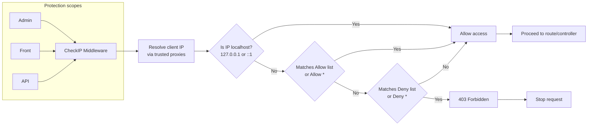

# CheckIP Plugin (English)

🌐 **English** | [Tiếng Việt](readme_vi.md)

CheckIP plugin helps manage and block IP addresses accessing the GP247 system.

> **Requires GP247 Core 2.0.** The admin screen runs on the TailAdmin (Livewire) shell.

## Features
- Manage IP lists with two types: **allow** and **deny**.
- Support wildcard `*`:
  - `*` in allow: allow all IPs.
  - `*` in deny: deny all IPs (unless already allowed beforehand).
- Processing priority: allow > deny.
- Livewire admin UI (TailAdmin) to create/update/delete, with add/edit form and allow/deny lists side by side.
- Field `status` (ON/OFF) per record to quickly enable/disable (default ON when creating new).

## Middleware
- Class: `App\GP247\Plugins\CheckIP\Middleware\CheckIP`
- Flow (simplified):
  1. Resolve the client IP from the framework (`request()->ips()`), honouring trusted proxies (see below).
  2. If IP matches allow list (or allow `*`) or is localhost (`127.0.0.1`, `::1`) => allow.
  3. Else, if IP matches deny list (or deny `*`) => return 403.
  4. Otherwise => allow.

## Client IP & trusted proxies
The client IP is resolved by Laravel via `request()->ips()`, which honours `config/trustedproxy.php`
(the `TRUSTED_PROXIES` env value). Forwarded headers (`X-Forwarded-For`, `CF-Connecting-IP`) are **not**
trusted unless they come from a proxy you explicitly declare — this prevents a client from spoofing a
header (e.g. `X-Forwarded-For: 127.0.0.1`) to bypass deny rules.

- **Bare host** (Nginx/Apache → PHP-FPM directly): leave `TRUSTED_PROXIES` unset. The real client IP is
  the direct connection — nothing to trust.
- **Behind a reverse proxy / Cloudflare**: set `TRUSTED_PROXIES` in `.env` (e.g. `127.0.0.1` for a local
  `proxy_pass`, or Cloudflare's IP ranges) so the genuine visitor IP is detected. If you do not, every
  visitor appears as the proxy's IP and the allow/deny rules apply to all of them together.
- **Localhost** (`127.0.0.1`, `::1`) is always allowed, so local access is never locked out.

> ⚠️ The middleware also protects the **Admin** area. Avoid a deny `*` (or denying your own IP) unless a
> trusted allow rule keeps your access — otherwise you may lock yourself out and have to edit the database
> to recover.

## Activity Diagram

Protection scopes: Admin, Front, API (all go through the `CheckIP` middleware).



## Installation
You can install using the following methods (similar to the plugin guide on GP247 Store):

### Method 1 (Manual)
1. Copy the source code into the folder `app/GP247/Plugins/CheckIP`.
2. Go to Admin > Plugins, find the CheckIP plugin to install and activate.

### Method 2 (Import ZIP file)
1. Go to Admin > Plugins > tab "Install from file".
2. Upload the plugin ZIP package and confirm installation.

### Method 3 (Library)
1. Go to Admin > Plugins > tab "Plugin Library".
2. Find "CheckIP" and click Install.

### Method 4: Install from the command line (CLI, gp247 3.x)

Since gp247 3.x you can download **CheckIP** from the GP247 library and install it straight from the command line, without opening the admin. The plugin has no other package prerequisites. Open a terminal in the website's root folder and run:

```bash
# 1) Once per website: register the (free) API License that connects the site to the GP247 library
php artisan gp247:ext-register-license

# 2) Download the plugin from the library and install it
php artisan gp247:ext-install --type=plugin --key=CheckIP
```

- Before step 1, make sure `APP_URL` in `.env` is the website's **real domain** (not `http://localhost`) — the license is bound to that domain.
- Once installed, the plugin is **enabled** and caches are refreshed automatically; nothing else is needed in the admin.
- The command checks the requirements declared in `gp247.json` (core version, composer packages, required plugins) and stops with a clear message if something is missing.
- If the folder `app/GP247/Plugins/CheckIP` is already on the server (copied manually or shipped with the installer), the command **installs it in place** instead of downloading it again.
- The command refuses a plugin that is already installed. To move to a newer version, run `php artisan gp247:ext-update --type=plugin --key=CheckIP`.
- Append `--json` to get machine-readable output (for scripts/CI).
- The steps in "Activation & Usage" below still apply.
- More: [Installing Plugins & Templates](https://github.com/gp247net/gp247-docs/blob/main/extension/install-extension.md) · [Command reference](https://github.com/gp247net/gp247-docs/blob/main/system/command-line-reference.md).

## Activation & Usage
- After installation, go to Admin > Security > CheckIP (menu name under SECURITY group) to manage.
- Create a record:
  - `description`: short description.
  - `ip`: IP address (e.g., `203.0.113.10`) or `*`.
  - `type`: choose `allow` or `deny`.
  - `status`: ON to apply, OFF to temporarily disable.
- Note: `allow` has higher priority than `deny`.

## Links
- Reference page (GP247 Store): `https://gp247.net/en/product/plugin-checkip.html`
- GitHub (source code): `https://github.com/gp247net/CheckIP`

## License
Plugin developed by GP247.

---
**Last updated:** 2026-09-25
